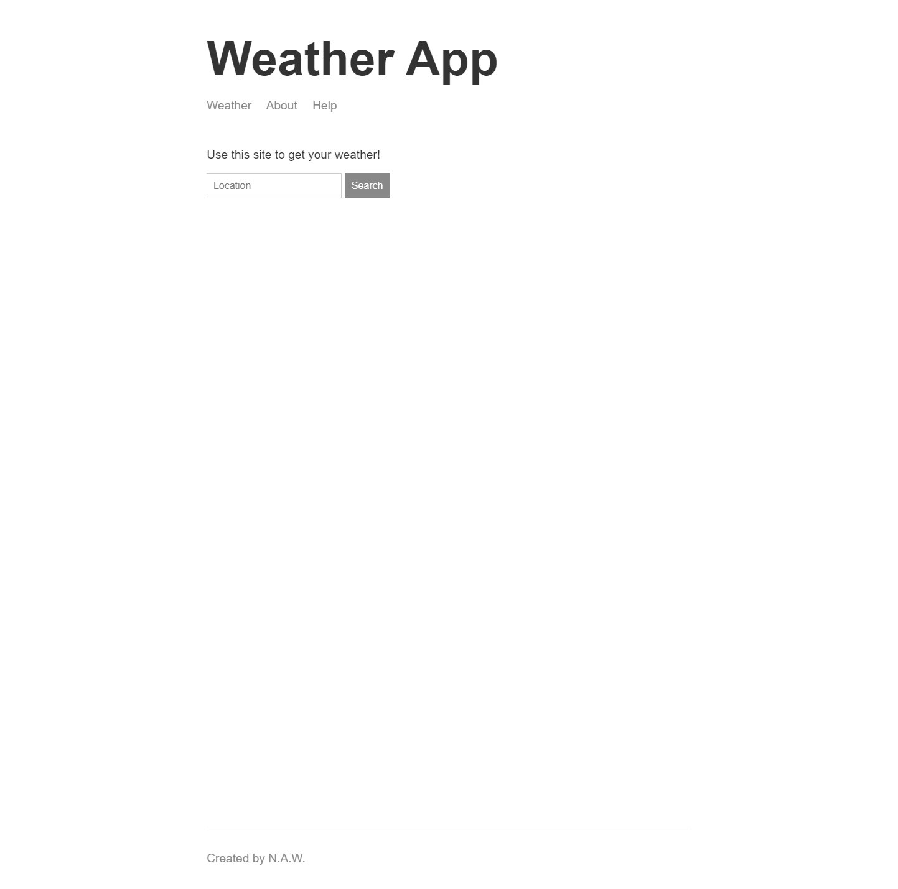
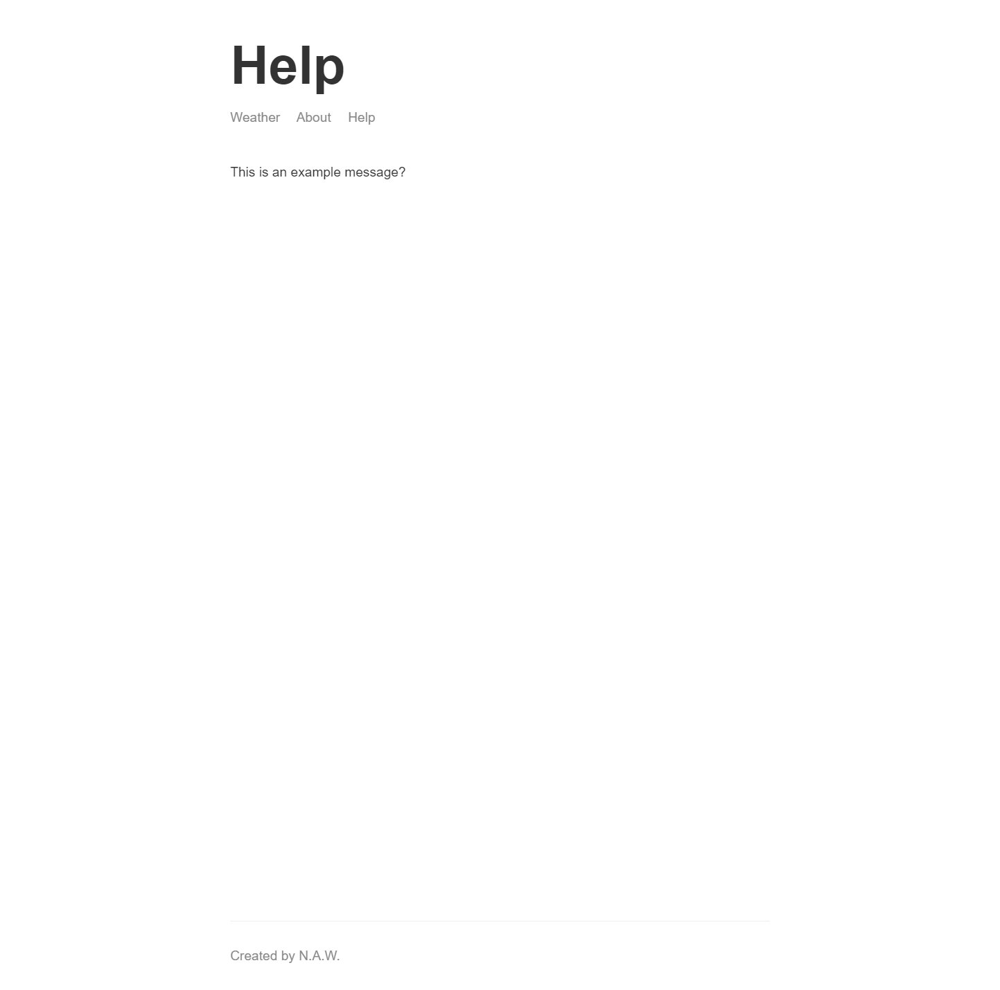
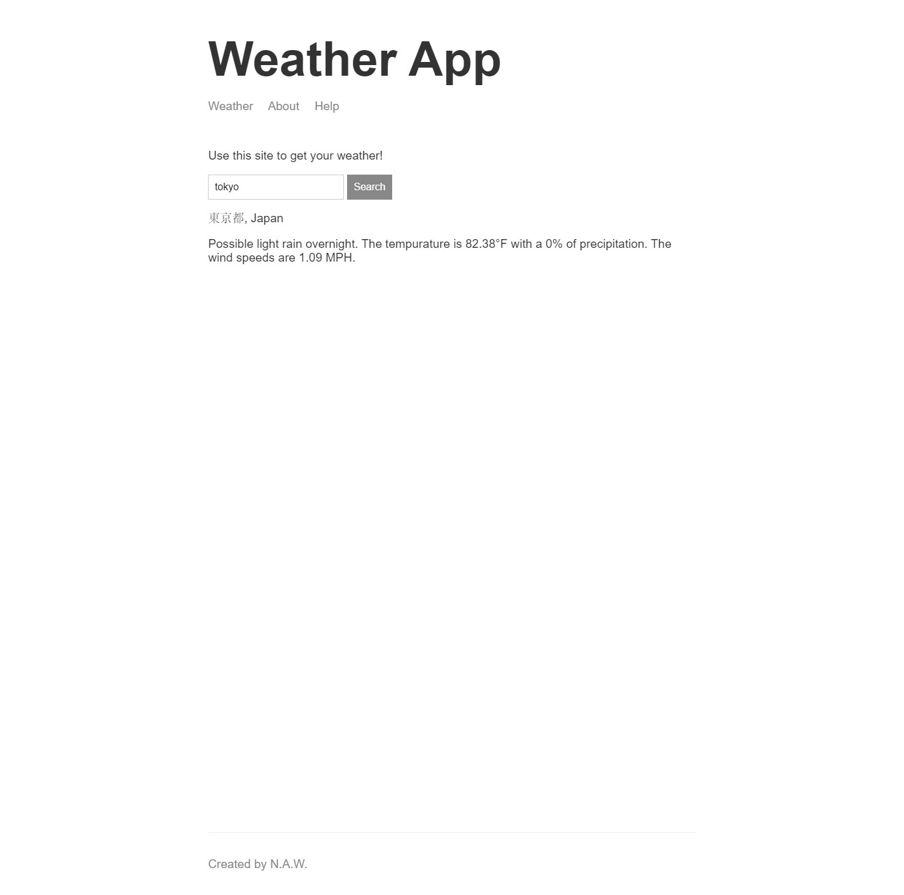

# wills-weather-app
This is a fullstack Node.js weather fetching app. Made with guidance from Andrew Mead's "The Complete Node.js Developer Course". Excellent course, would recommend.

## HOW DOES IT WORK?
The frontend interface is very simple. The main page is just a form and a submit button. It's using handlebars.js to handle the templating for the footer and the header. There is a little bit of custom css involved as well to make the app's overall appearance a bit nicer.

The backend is using Express.js for routing and for creating the server on the port based on the environment variable. There are a couple of utility scripts also being used. These scripts are using Mapbox's API for requesting a coordinate based on the name of a location and Darksky's API for getting a long list of related weather data based on the coordinated previously mentioned.

When sending a POST request /weather with the name of a location included, it gets converted to a set of coordinated. Those coordinates are then used to retrieve the weather at said coordinates.

## SCREENSHOTS

